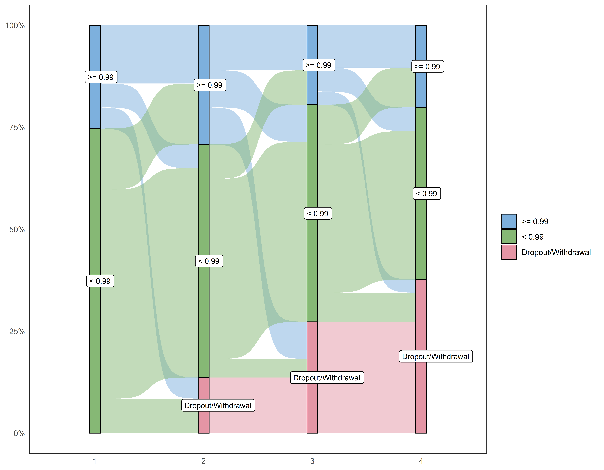
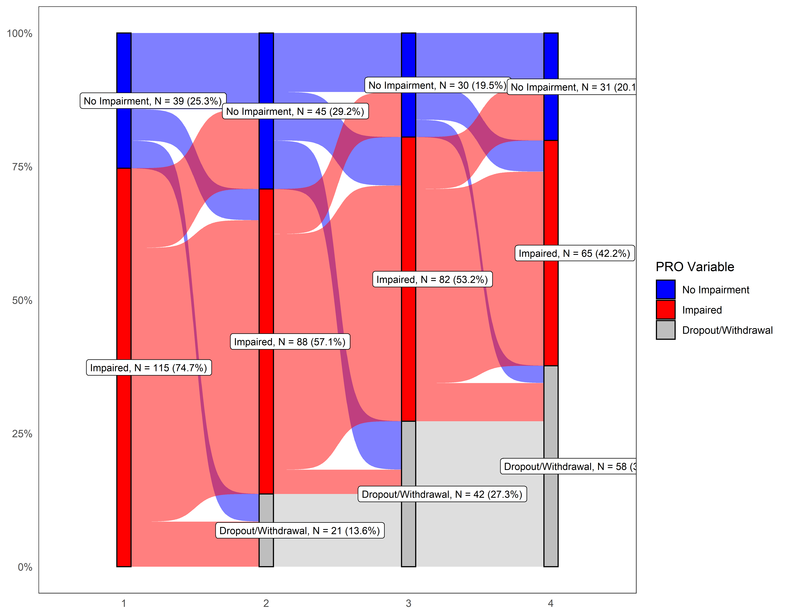
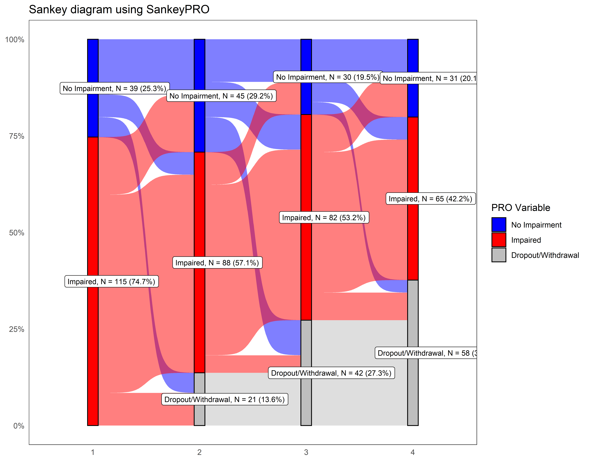

# SankeyPRO
Create Sankey diagrams from patient-recorded outcomes (PRO) data or other data

## Introduction
The visualization of patient-recorded outcomes ([PRO](https://en.wikipedia.org/wiki/Patient-reported_outcome)) over time can provide preliminary evaluations of temporal trends. One visualization, the [Sankey diagram](https://en.wikipedia.org/wiki/Alluvial_diagram), nicely shows both the frequency and redistribution of a PRO's categories from one time point to the next.

The R package *SankeyPRO* readily allows the alluvial visualization of a single PRO variable collected at multiple time points.

## Preliminaries
The *SankeyPRO* R package is fairly easy to set up. In an R session:
```r
install.packages("remotes") # If necessary.
## https://github.com/r-lib/remotes#environment-variables
Sys.setenv(R_REMOTES_NO_ERRORS_FROM_WARNINGS = "true")
remotes::install_github("priscian/SankeyPRO")
library(SankeyPRO)

## Once the package has been installed as described above, all you need to use it is:
library(SankeyPRO)
```

## Using *SankeyPRO*
The input PRO data should be in so-called long format, with a single entry for every subject for every time point, e.g.

```r
> pro
# A tibble: 500 × 3
      id  time pro_var
   <dbl> <int>   <int>
 1   547     1       0
 2   547     2       1
 3   547     3       3
 4   658     1       1
 5   385     1       1
 6   385     2       2
 7   385     3       1
 8   385     4       1
 9   202     1       2
10   202     2       2
# … with 490 more rows
```

You can then produce a Sankey diagram by calling the function `plot_sankeypro()` and relying mostly on its default arguments:

```r
plot_sankeypro(
  x = pro, # Or a long data set imported from elsewhere
  pro_var = "pro_var",
  time_var = "time",
  id_var = "id",
  node_cutpoints = c(.99)
)
```



It's relatively easy to include parameters that change the node labels, add counts and percentages to the node labels, and change the node colors.

```r
p <- plot_sankeypro(
  x = pro, # Or a long data set imported from elsewhere
  pro_var = "pro_var",
  time_var = "time",
  id_var = "id",
  node_cutpoints = c(.99),
  ##              N/A                   < 0.99      >= 0.99
  node_labels = c("Dropout/Withdrawal", "Impaired", "No Impairment"),
  node_colors = c("gray", "red", "blue"),
  legend_title = "PRO Variable",
  show_counts = TRUE
)
```



Note that `plot_sankeypro()` returns a `ggplot` object that can be augmented via the additive ["grammar of graphics"](https://ggplot2-book.org/mastery.html) approach introduced in the [ggplot2](https://ggplot2.tidyverse.org/) package.

```r
p + ggplot2::labs(title = "Sankey diagram using SankeyPRO") %>% print
```



This is the function signature of `plot_sankeypro()` with annotations:

```r
plot_sankeypro <- function(
  x, # long data set imported from REDCap etc.
  pro_var, # Name of PRO variable
  time_var, # Variable containing names of the PRO time points, e.g. "Assessment"
  id_var, # Name of ID variable distinguishing patients from one another
  node_cutpoints = NULL,
  node_labels = NULL,
  node_colors,
  legend_title = "",
  show_counts = FALSE, # Should the plot display counts & percentages on node labels?
  ## Less-frequently used arguments:
  long_to_wide... = list(),
  ## 'remove_intermittent': If FALSE, rowwise: At 1st NA from left to right, make all further rightwise columns into NAs; else
  ## If TRUE, remove the intermittently valued rows described above
  remove_intermittent = TRUE,
  node_fmt = "%1.2f",
  show_plot = TRUE
)
{...}
```
